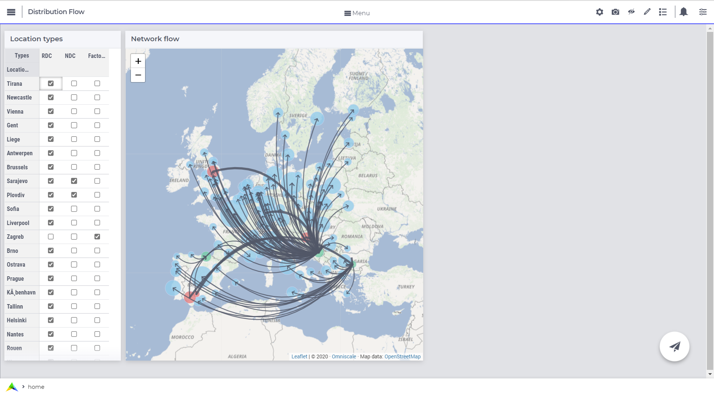
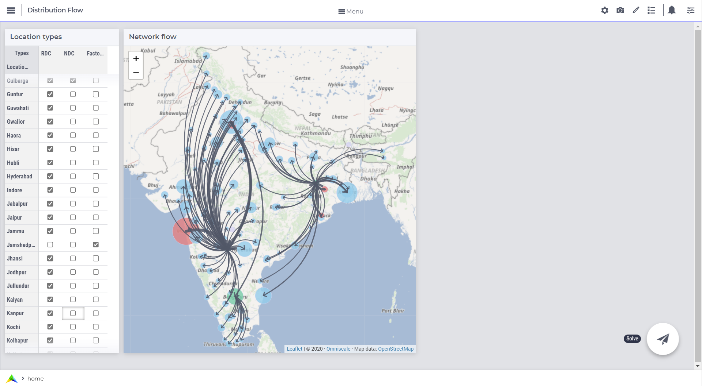

# flow-optimization

Basic application built in the [AIMMS](https://www.aimms.com) IDE that minimizes transportation cost on a hierachical network given the demand on each location.

## AIMMS

AIMMS stands for *A*dvanced *I*nteractive *M*ultidimensional *M*odeling *S*ystem. It simplifies building and solving mathematical models.
The software takes the shape of an IDE which main functionality is solving equations of __n__-dimensional vectors of parameters and variables, subject to constraints defined by the user.

## Network

The network in the problem is defined as a set of nodes which can be
- Factories
- National distribution centers (CDN)
- Regional distribution centers (RDN)
Factories only produce goods and are the origin of the flow inside the network. CDNs are mid-tier locations where factories distribute goods and they can only ship to RDNs. RDNs are the last link in the chain and they supply the demand.

Demand is proportional to the population of the location (with some random error).
Transportation costs are proportional to the spherical distance ([Haversine formula](https://community.esri.com/t5/coordinate-reference-systems-blog/distance-on-a-sphere-the-haversine-formula/ba-p/902128)).
  
## Input

### Data
The program is prepared to recieve data via a MySQL database or Excel files. The repository includes an Excel file with the appropiate format.
To read data from a DB, names of columns and schema must match the ones in the program.

### GUI
The network is, by default, created automatically at initialization in Europe. Locations are fixed but the type of each location is random and changes each run.
The user can remove locations and change their type. While adding locations is also possible, it requires modifying the program to read the desired data.

